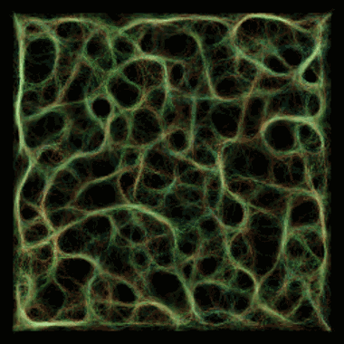
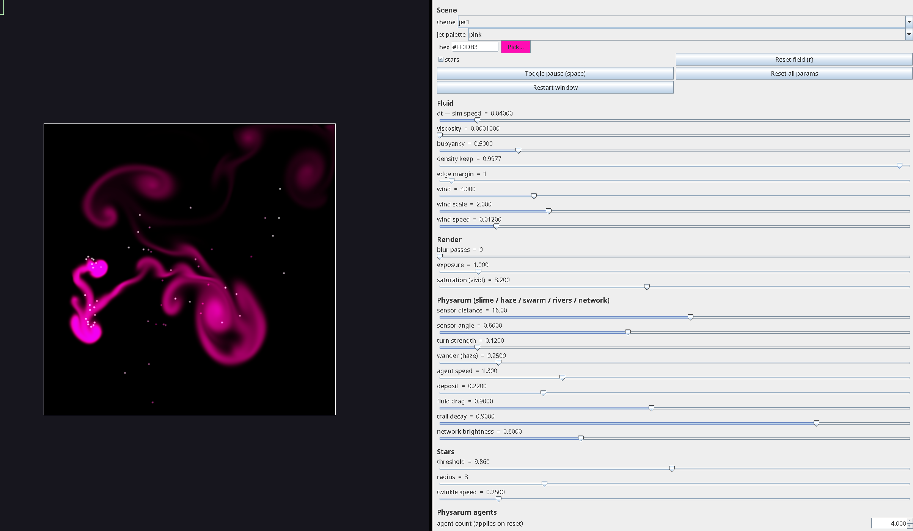

# bjs-smoke-viz

Real-time generative smoke in Clojure: a **spectral (FFT) Stable-Fluids** solver,
driven by a **Physarum** (slime-mould) agent layer, with additive colour mixing,
a procedural noise-field wind, twinkling "stars", and switchable scene **themes**.
Rendered with [Quil](http://quil.info/).



<video src="assets/box.mp4" controls width="100%"></video>

[▶ box.mp4](assets/box.mp4)

## Run

```bash
clj -M:run        # opens the window
```

Drag the mouse to push/paint smoke. `space` pauses, `r` resets.

## Controls

**There are controls** — a second window of live sliders/dropdowns opens
alongside the sketch. Every knob writes straight into the running simulation (no
relaunch): theme, fluid (dt, viscosity, buoyancy, wind…), render (exposure,
**saturation**), the Physarum agent parameters, and stars — plus a colour picker
(palette dropdown + hex field) for the single-source `:jet1` theme. Buttons reset
the field or all params, toggle pause, and restart the window.



## Themes (modes)

A theme bundles a *mode* with its config — switch theme, switch the whole look.
Physarum themes also carry their own parameter defaults (applied on switch). Pick
one from the controls dropdown, or `(swap! sc/params assoc :theme …)` + `start!`:

| theme | what |
|-------|------|
| `:slime`   | **default** — agents steer toward their own colour → flowing coloured **networks**. |
| `:haze`    | the smoke *is* the agents: they **wander** instead of steering → diffuse coloured **smoke**, no networks. |
| `:swarm`   | a few bright wandering agents = moving **smoke sources**. |
| `:rivers`  | faint steering + wander → flowing **strands**, between networks and smoke. |
| `:jets`    | colored moving **sources** emit the smoke (Brownian drift + boids flocking), no Physarum. |
| `:jet1`    | a **single** moving source; its colour is steered live via the controls colour picker. |
| `:network` | the classic **white** Physarum network on its own trail map. |

On top of any theme, **stars** spawn as persistent bright particles at
high-density peaks — they drift, twinkle white, and die at the window edge.

## Live coding

```bash
clj -M:nrepl      # connect your editor, then:
```

```clojure
(require '[smoke.core :as sc])
(sc/start!)                                  ; (re)launch + opens the controls window
(sc/start! :size 1200)                       ; bigger window  ·  (sc/start! :fullscreen true)
(swap! sc/params assoc :theme :haze)         ; :slime :haze :swarm :rivers :jets :jet1 :network
(swap! sc/params assoc :saturation 3.0)      ; vivid hues (chroma boost, less white-out)
(swap! sc/params assoc :p-wander 0.7)        ; agent random-walk (smoke vs networks)
(swap! sc/params assoc :star-thresh 3.5)     ; rarer stars   ·  :stars false to disable
(sc/save-frame! "/tmp/f.png")                ; dump the current frame
(smoke.controls/open!)                       ; (re)open the controls window
```

Knobs live in `smoke.scene/default-params` (and per-theme `:p-defaults`);
handlers are `#'`vars so functions can be redefined live too. The controls window
(`smoke.controls`) just mutates the same `sc/params` atom.

## How it works

- **Fluid** (`smoke.fluid`) — Jos Stam's spectral *Stable Fluids*: `add force →
  self-advect → FFT → diffuse+project → IFFT`. The projection onto
  divergence-free flow is exact in Fourier space (remove the component of each
  wavevector parallel to **k**), so there's no iterative solver and no
  collocated-grid checkerboard. The domain is periodic; an absorbing sponge
  border fades flow at the edges. Density is carried in **R/G/B channels** so
  colours mix additively.
- **Physarum** (`smoke.physarum`) — agents sense a field at 3 forward sensors,
  steer toward the strongest, move (dragged by the fluid wind), and deposit. In
  `:slime`/`:rivers` they sense their own colour and deposit it → coloured
  networks; in `:haze`/`:swarm` they skip steering and **wander** → diffuse
  smoke; in `:network` they use a separate white trail that diffuses + decays
  (Jones 2010).
- **Colour** — density lives in additive R/G/B channels, so overlapping hues mix
  toward white. The renderer tonemaps each channel (exposure) and applies a
  **saturation** (chroma) boost that pushes pixels away from their grey mean, so
  the dominant hue shows instead of washing out.
- **Boids** (`smoke.boids`) — in `:jets`, the handful of sources flock
  (separation / alignment / cohesion) so the emitters drift in loose coordination.
- **Wind** — a procedural noise flow-field force, so the smoke gusts and swirls.
- **Stars** — persistent particles spawned at density peaks, drifting and
  flashing white via a time lerp (rendered as bright colour discs).
- **Headless** (`smoke.headless`) — render frames to PNG with no window
  (`snap`, `film`); used for tuning, stills, and the GIFs here.

## References

- Jos Stam, *Stable Fluids*, SIGGRAPH 1999 — the spectral/FFT method used here.
- R. Fedkiw, J. Stam, H. Jensen, *Visual Simulation of Smoke*, SIGGRAPH 2001.
- Jeff Jones, *Characteristics of Pattern Formation and Evolution in Approximations
  of Physarum Transport Networks*, Artificial Life 2010 — the slime-mould model.
- Craig Reynolds, *Flocks, Herds, and Schools: A Distributed Behavioral Model*,
  SIGGRAPH 1987 — boids.
- Reference FFT Stable-Fluids ports: [daichi-ishida](https://github.com/daichi-ishida/Stable-Fluids),
  [richardbenstead](https://github.com/richardbenstead/Stable-Fluids).

## Libraries

[Quil](http://quil.info/) (rendering) · [JTransforms](https://github.com/wendykierp/JTransforms)
(FFT) · [dtype-next](https://github.com/cnuernber/dtype-next).
