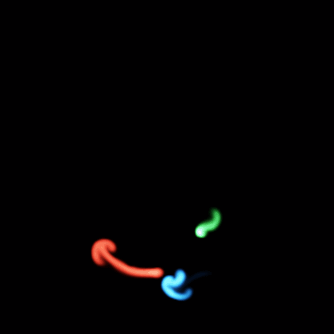

# bjs-smoke-viz

Real-time 2D smoke in Clojure — a **spectral (FFT) Stable-Fluids** solver with
multiple moving coloured sources that mix additively, procedural noise-field
wind, and configurable scene **themes**. Rendered with [Quil](http://quil.info/).



## Run

```bash
clj -M:run        # opens the window
```

Drag the mouse to push smoke. `space` pauses, `r` resets.

## Live coding

```bash
clj -M:nrepl      # connect your editor, then tweak live:
```

```clojure
(require '[smoke.core :as sc])
(sc/start!)                                   ; (re)launch the window
(swap! sc/params assoc :theme :duet)          ; :rgb :duet :single
(swap! sc/params assoc :wind 8 :noise-scale 3) ; gustier, finer wind
(sc/save-frame! "/tmp/f.png")                  ; dump the current frame
```

Every knob lives in the `smoke.scene/default-params` map and is hot-swappable;
the sketch handlers are `#'`vars so you can redefine functions live too.

## How it works

Per frame the velocity field is advanced by Jos Stam's spectral method:

```
add force → self-advect (semi-Lagrangian) → FFT → diffuse + project → IFFT
```

The projection onto divergence-free (mass-conserving) flow is done **exactly** in
Fourier space — for each wavevector **k**, remove the component of velocity
parallel to **k**, and damp by `exp(-|k|²·dt·visc)` for viscosity. No iterative
pressure solve, and no collocated-grid checkerboard. The FFT domain is periodic;
an absorbing **sponge border** fades flow at the edges so it reads as walls.

Density is carried in three colour channels (R/G/B), all advected on the shared
velocity field, so overlapping coloured jets mix additively. Wind is a procedural
noise flow-field, so the smoke gusts and swirls.

### Layout

| file | what |
|------|------|
| `src/smoke/fluid.clj`    | the spectral solver: `vel-step`, `advect-colors!`, FFT diffuse+project, sponge border, blur. |
| `src/smoke/scene.clj`    | Quil-free scene: moving coloured sources, `themes`, noise wind, params, RGB renderer. |
| `src/smoke/core.clj`     | Quil window, input, render loop, REPL helpers (`save-frame!`, `dens-stats`). |
| `src/smoke/headless.clj` | render frames to PNG with no window (`snap`, `film`) — for tuning, stills, and GIFs. |

### Themes

A theme is a scene preset — a list of sources, each with a colour, emit rate,
radius, and motion (`:static` / `:osc-x` / `:osc-y` / `:circle`). Add one by
appending to `smoke.scene/themes`.

## Roadmap

- [ ] Physarum (slime-mould) growth layer coupled to the same velocity/density grid.

## References

**Algorithm**
- Jos Stam, *Stable Fluids*, SIGGRAPH 1999 — the spectral/FFT method used here.
- Jos Stam, *Real-Time Fluid Dynamics for Games*, GDC 2003 — the grid-based primer.
- R. Fedkiw, J. Stam, H. Jensen, *Visual Simulation of Smoke*, SIGGRAPH 2001 — buoyancy & vorticity.

**Reference implementations** (C++/FFTW, the basis for this port)
- daichi-ishida/Stable-Fluids — https://github.com/daichi-ishida/Stable-Fluids
- richardbenstead/Stable-Fluids — https://github.com/richardbenstead/Stable-Fluids

**Planned**
- Jeff Jones, *Characteristics of Pattern Formation and Evolution in Approximations of Physarum Transport Networks*, Artificial Life, 2010.

**Libraries**
- [Quil](http://quil.info/) (Processing) — windowing & rendering.
- [JTransforms](https://github.com/wendykierp/JTransforms) — pure-Java FFT.
- [dtype-next](https://github.com/cnuernber/dtype-next) — typed array buffers.
